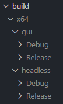

# Sick

## Installation

1. **Install OpenCV**
* [Download OpenCV 4.8.0](https://github.com/opencv/opencv/releases/tag/4.8.0)
* Set environment variable "OPENCV_DIR" to root install directory

2. **Install Boost**
* [Download Boost 1.8.4](https://www.boost.org/users/download/)
* Set environment variable "BOOST_DIR" to root install directory

3. **Install Visual Studio 2022**
* [Download Visual Studio](https://visualstudio.microsoft.com/downloads/)
* Follow the steps of the installer and when prompted, check the "Desktop development with C++" workload
* For detailed info on the Visual Studio version used, [look here](./docs/visual_studio_info)

## Building

### Visual Studio

To build the solution, open the solution file (sick.sln) in Visual Studio. Once the solution loads, you will see three projects in the *'solution explorer'*: 'gui', 'headless', and 'common'.

Select your desired configuration and then *'Build Solution'* either in the *'build'* tab or from the *'solution explorer'*. You should see the build progress in the *'output'* window

> **Note:** The *'Debug'* configuration does not build with optimizations, so it can be **very slow**. Always use *'Release'* when distributing.

If all goes well, you should see a success message. If you get any errors, the *'output'* window should point you in the right direction on what to google, or you can [open a new issue](https://github.com/NickTheWhale/sick/issues/new). 

## Distributing

After building, Visual Studio will generate a *'./build/x64/\<project_name\>/\<configuration\>'* directory containing each project's build output. 



Distrubuting should be as simple as copying the contents containing the executable you want to run (ex. build/x64/gui/release/) to the target machine.

## Usage

### gui

Run by opening 'gui.exe'

### headless

*[Example configuration file](./example_configuration.json)*

The configuration file is loaded at application startup and is used to set the PLC and camera settings. 

```cmd
headless.exe <path_to_config> --filters <path_to_optional_filters>
```

## Prebuilt Binaries

If you just want to download the latest version without building from source, you can do so [here](https://github.com/NickTheWhale/sick/releases).
